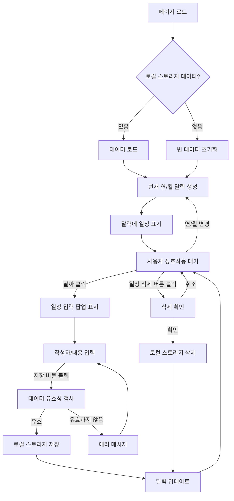

# 행정실 업무 현황표 개발 계획

## 개요
HTML, CSS, JavaScript를 사용하여 웹 페이지 형태로 행정실 업무 현황표를 개발합니다. 일정 데이터는 브라우저의 로컬 스토리지에 저장합니다.

## 기술 스택
*   HTML5
*   CSS3
*   JavaScript (Vanilla JS)
*   브라우저 로컬 스토리지

## 파일 구조
```
.
├── index.html
├── style.css
└── script.js
```

## 상세 계획

### 1. `index.html` (구조)
업무 현황표의 기본 레이아웃과 요소를 정의합니다.
*   HTML 문서 기본 구조 (DOCTYPE, html, head, body)
*   `<head>`: 페이지 제목, 메타 태그, `style.css` 파일 링크
*   `<body>`:
    *   달력 표시 영역 (`div` 또는 `section`)
        *   연/월 선택을 위한 `<select>` 또는 `<input type="number">` 요소 및 버튼
        *   달력 그리드를 표시할 영역 (`div` 또는 `table`)
    *   일정 입력/수정 팝업 영역 (`div`) - 초기에는 숨김 처리
        *   선택된 날짜를 표시할 요소
        *   작성자 입력 필드 (`<input type="text">`)
        *   내용 입력 필드 (`<textarea>`)
        *   저장 버튼 (`<button>`)
        *   삭제 버튼 (`<button>`) - 일정 수정 시에만 표시
        *   닫기 버튼 (`<button>`)
    *   `script.js` 파일 링크 (body 태그 닫히기 전)

### 2. `style.css` (스타일)
업무 현황표의 시각적인 디자인을 담당합니다.
*   전체 페이지 및 기본 요소 스타일 초기화
*   달력 컨테이너 및 레이아웃 스타일 (Flexbox 또는 Grid 활용)
*   달력 헤더 (연/월 선택, 버튼) 스타일
*   달력 그리드 (요일, 날짜 셀) 스타일
*   각 날짜 셀의 크기, 패딩, 테두리 등 디자인
*   일정이 있는 날짜 셀에 대한 시각적 구분 스타일 (배경색, 아이콘 등)
*   날짜 셀 내부에 일정을 간략히 표시하는 스타일
*   일정 입력 팝업의 위치 (화면 우측 고정), 크기, 배경, 그림자 등 스타일
*   팝업 내부 입력 필드, 버튼 등의 스타일
*   팝업 표시/숨김을 위한 CSS 클래스 정의 (`display: none;` 또는 `visibility: hidden;` 활용)

### 3. `script.js` (기능 구현)
업무 현황표의 모든 동적인 기능을 처리합니다.
*   **DOM 로드 이벤트 리스너:** 페이지 로드 완료 후 초기화 함수 실행
*   **초기화 함수:**
    *   현재 연도와 월을 가져와 전역 변수에 저장
    *   `loadEvents()` 함수를 호출하여 로컬 스토리지에서 기존 일정 데이터 로드
    *   `renderCalendar()` 함수를 호출하여 현재 연/월 달력 생성 및 표시
*   **`renderCalendar(year, month)` 함수:**
    *   주어진 연도와 월에 해당하는 달력 데이터 계산 (해당 월의 첫 날 요일, 총 날짜 수 등)
    *   달력 그리드를 동적으로 생성 (테이블 또는 div 요소 활용)
    *   각 날짜 셀에 `data-date="YYYY-MM-DD"` 형식으로 날짜 정보 저장
    *   `displayEvents()` 함수를 호출하여 해당 월의 일정을 달력에 표시
    *   이전/다음 월 이동 버튼 및 연/월 선택 드롭다운에 이벤트 리스너 연결
*   **`loadEvents()` 함수:**
    *   `localStorage.getItem('taskEvents')`를 사용하여 로컬 스토리지에서 데이터 가져오기
    *   가져온 JSON 문자열을 `JSON.parse()`를 사용하여 JavaScript 객체로 변환
    *   데이터가 없거나 파싱 오류 발생 시 빈 객체 `{}` 반환
*   **`saveEvents(events)` 함수:**
    *   주어진 일정 객체를 `JSON.stringify()`를 사용하여 JSON 문자열로 변환
    *   `localStorage.setItem('taskEvents', jsonString)`를 사용하여 로컬 스토리지에 저장
*   **`displayEvents()` 함수:**
    *   현재 달력에 표시된 날짜 셀을 순회
    *   각 날짜에 해당하는 일정을 로드된 데이터에서 찾아 해당 날짜 셀 내부에 표시 (간략한 내용 또는 개수)
    *   일정 삭제 버튼 등 필요한 UI 요소 추가 (동적으로 생성)
*   **날짜 셀 클릭 이벤트 리스너:**
    *   클릭된 날짜 셀의 `data-date` 속성 값 가져오기
    *   팝업 제목을 선택된 날짜로 업데이트
    *   해당 날짜의 기존 일정을 로드하여 팝업의 입력 필드에 채우기 (수정 모드)
    *   팝업 표시 (`style.display = 'block'`)
*   **팝업 저장 버튼 클릭 이벤트 리스너:**
    *   팝업에서 작성자 및 내용 입력 값 가져오기
    *   선택된 날짜 가져오기
    *   새로운 일정 객체 생성 `{ author: '...', content: '...' }`
    *   로컬 스토리지에서 해당 날짜의 기존 일정 배열을 가져와 새 일정 추가
    *   `saveEvents()` 함수를 호출하여 로컬 스토리지에 저장
    *   `renderCalendar()` 함수를 호출하여 달력 업데이트
    *   팝업 숨김
*   **팝업 삭제 버튼 클릭 이벤트 리스너:**
    *   삭제할 일정의 날짜 및 인덱스 정보 가져오기
    *   로컬 스토리지에서 해당 날짜의 일정 배열을 가져와 해당 인덱스의 일정 제거
    *   `saveEvents()` 함수를 호출하여 로컬 스토리지에 저장
    *   `renderCalendar()` 함수를 호출하여 달력 업데이트
    *   팝업 숨김
*   **팝업 닫기 버튼 클릭 이벤트 리스너:**
    *   팝업 숨김

## 데이터 구조 (로컬 스토리지)
로컬 스토리지에는 `taskEvents`라는 키로 JSON 문자열이 저장됩니다.
```json
{
  "YYYY-MM-DD": [
    {
      "author": "작성자1",
      "content": "내용1"
    },
    {
      "author": "작성자2",
      "content": "내용2"
    }
  ],
  "YYYY-MM-DD": [
    {
      "author": "작성자3",
      "content": "내용3"
    }
  ],
  ...
}
```
각 날짜(`YYYY-MM-DD`)를 키로 가지며, 값은 해당 날짜의 일정 객체 배열입니다. 각 일정 객체는 `author`와 `content` 속성을 가집니다.

## 워크플로우


## 다음 단계
계획에 따라 `index.html`, `style.css`, `script.js` 파일을 작성합니다.